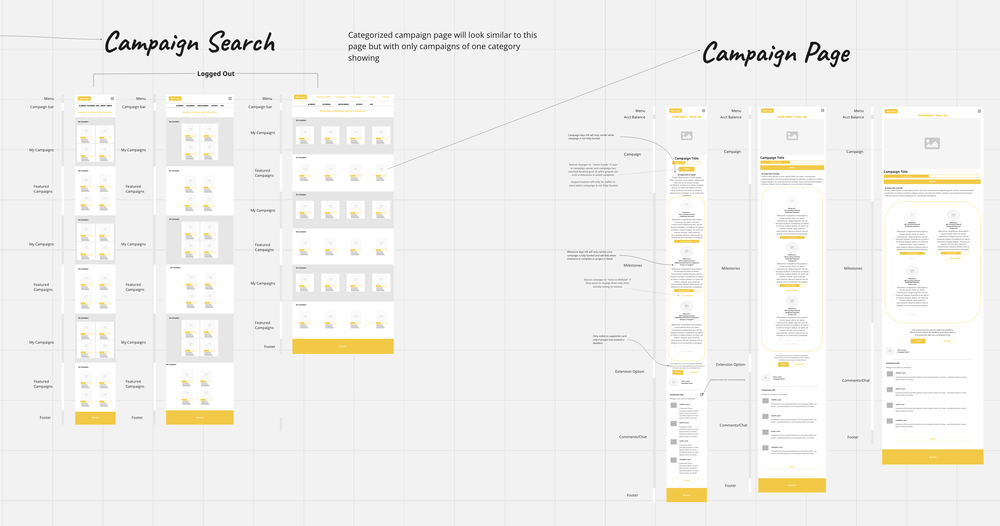

<a name="readme-top"></a>

<!-- PROJECT SHIELDS -->
<!--
*** I'm using markdown "reference style" links for readability.
*** Reference links are enclosed in brackets [ ] instead of parentheses ( ).
*** See the bottom of this document for the declaration of the reference variables
*** for contributors-url, forks-url, etc. This is an optional, concise syntax you may use.
*** https://www.markdownguide.org/basic-syntax/#reference-style-links

-->

<!-- ABOUT THE PROJECT -->

## About The Project

<!-- PROJECT LOGO -->



<!-- TABLE OF CONTENTS -->
<details>
  <summary>Table of Contents</summary>
  <ol>
    <li>
      <a href="#about-the-project">About The Project</a>
      <ul>
        <li><a href="#built-with">Built With</a></li>
      </ul>
    </li>
    <li>
      <a href="#getting-started">Getting Started</a>
      <ul>
        <li><a href="#prerequisites">Prerequisites</a></li>
        <li><a href="#installation">Installation</a></li>
      </ul>
    </li>
    
  </ol>
</details>

<h3 align="center">Wax Croudfund Motivation</h3>
  <p align="left">
  Introducing Waxu, an innovative decentralized application (dapp) poised to revolutionize project funding on the Wax blockchain. With our groundbreaking smart contract technology, individuals and teams can seamlessly create campaigns and mobilize resources to bring their ideas to life.
  
  Powered by the Wax blockchain, WaxMu offers a transparent and efficient platform for crowdfunding, empowering creators across various industries to access the resources they need to realize their visions. Whether it's launching a new product, funding a community initiative, or kickstarting a creative endeavor, WaxMu provides the tools and infrastructure necessary to turn dreams into reality.
  
  Our motivaiton is simple: to foster innovation and drive the growth of the Wax blockchain ecosystem. By democratizing access to funding and streamlining the fundraising process, we aim to catalyze the development of diverse projects while strengthening the foundation of decentralized technology.
  
  Join us on this journey as we pave the way for a more inclusive and collaborative approach to project funding. Together, let's build a future where creativity knows no bounds, powered by the limitless possibilities of blockchain technology!

  </p>
</div>

<p align="right">(<a href="#readme-top">back to top</a>)</p>

### Built With

#### Tools

- WHARFKIT
- VITE
- VITEST

#### Languages

- TYPESCRIPT

#### Frameworks and Libraries

- REACT
- BOOTSTRAP

<p align="right">(<a href="#readme-top">back to top</a>)</p>

<!-- GETTING STARTED -->

## Getting Started

To get a local copy up and running follow these simple example steps.

### Prerequisites

This is a list of things you need to use the software and how to install them.

- <a src = "https://docs.docker.com/engine/install/">Docker</a>

### Installation

1. Clone the repo
   ```sh
   git clone https://github.com/Cian-Software/internal-waxmu.git
   ```
2. Navigate to frontend/
   ```sh
   cd frontend/
   ```
3. Install NPM packages
   ```sh
   npm install
   ```
4. Execute run command
   ```sh
   npm run dev
   ```

<p align="right">(<a href="#readme-top">back to top</a>)</p>
